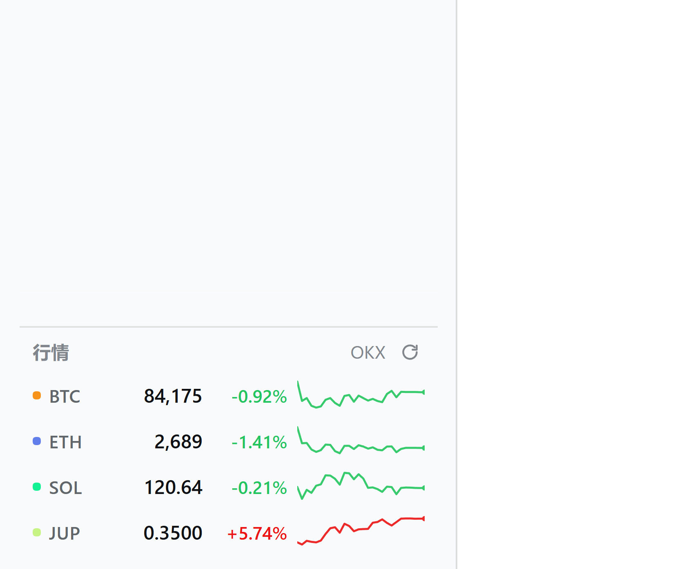

# dsh-plugin-crypto-ticker

给 [DSH（DeepSeek Harness）](https://github.com/deepseek-ai) Web GUI 用的加密货币行情卡片：**侧边栏左下角、余额与设置上方**，实时显示 BTC / ETH / SOL / JUP 等主流代币的价格、24 小时涨跌和迷你走势图。

**零依赖、免密钥、开箱即用**——不装任何其它插件也能正常显示（已在干净 profile 下用无头浏览器验证过）。



<sub>上图为真实页面截图（无头浏览器渲染，2× 像素密度）。完整界面见 [screenshot-full.png](screenshot-full.png)。</sub>

```
┌────────────────────────┐
│  …会话列表…             │
│                        │
│  行情             OKX ⟳   │
│  ● BTC   76,926  +1.72% ╱╲╱   │  ← 这张卡片
│  ● ETH    2,472  +3.72% ╱╲╱   │
│  ● SOL   102.00  +5.47% ╱╲╱   │
│  ● JUP     0.263 +13.4% ╱╲╱   │
│  ⚙ 设置                │
└────────────────────────┘
```

## 特性

- **红涨绿跌**（中文习惯），价格按量级自动选小数位，成交量按 K/M/B 缩写。
- **真实的 24 小时小时线**，不是装饰——首屏从交易所取 24 根 1H 收盘价，之后把实时读数续上去，线会一直动。
- 价格上跳标红、下跳标绿并短暂脉冲，扫一眼就知道刚在动。
- 点任意一行或表头 ⟳ 立即刷新；悬停看 24h 高/低、成交量、当前信源与更新时间。
- 侧边栏收成 56px 窄栏时自动变成「字标 + 价格」。
- 数据源自动降级：**OKX → Binance → CoinGecko**。全部不可用时保留最后已知价格并置灰、表头显示「已断开」，而不是清空界面。
- 宿主侧缓存，多个标签页共享同一份数据，不会因为开了三个窗口就把上游请求翻三倍。
- 自动适配系统代理（见下文），国内网络不用额外配置。

## 安装

### 方式一：`dsh plugin`（推荐）

```sh
dsh plugin --profile web add github:18569663yz-web/dsh-plugin-crypto-ticker
```

`dsh plugin` 会把包装进 `$DSH_HOME/profiles/web`，并**自动把它加入 profile 的 bundle 层栈**（因为本包的 `package.json` 声明了 `dsh.bundle.patch`）：

```json
"dsh": { "profile": { "bundles": [
  "@deepseek-ai/dsh-base", "@deepseek-ai/dsh-web-app", "dsh-plugin-crypto-ticker"
]}}
```

装完**重启 dsh web** 即可（桌面端则完全退出后重开）。

#### 国内网络：`ERR_PNPM_GIT_RESOLVE_FAILED`

`pnpm` 用 `git ls-remote` 解析 `github:` 依赖，**它只走 HTTPS，不读浏览器/系统的代理设置**。国内直连 github.com 经常超时，会报：

```
Error: ERR_PNPM_GIT_RESOLVE_FAILED
  ╰─▶ Failed to resolve git dependency "github:...": git ls-remote failed:
      fatal: unable to access 'https://github.com/...': Failed to connect to github.com port 443
```

有两个办法。**优先用预构建的 tarball**——它是打包好的 `.tgz`，pnpm 直接下载解包，完全不经过 git，所以不需要代理：

```sh
dsh plugin --profile web add https://github.com/18569663yz-web/dsh-plugin-crypto-ticker/releases/download/v0.1.0/dsh-plugin-crypto-ticker-0.1.0.tgz
```

每个 [Release](https://github.com/18569663yz-web/dsh-plugin-crypto-ticker/releases) 页面的 Assets 里都有这个文件，把版本号换成你想装的那个即可。

或者给这次安装配上代理（端口换成你自己的）：

```powershell
$env:HTTPS_PROXY = 'http://127.0.0.1:7890'
$env:HTTP_PROXY  = 'http://127.0.0.1:7890'
dsh plugin --profile web add github:18569663yz-web/dsh-plugin-crypto-ticker
```

> **插件运行时不需要这个。** 行情请求走的是本插件自带的传输层，它会自己读 Windows 系统代理（见下面「系统代理」一节），不受 `HTTPS_PROXY` 是否设置影响。

### 方式二：脚本安装（不经过 pnpm）

适合离线或不想动 node_modules 的场景：

```powershell
.\install-crypto-ticker-plugin.ps1 -Profile web          # 安装
.\install-crypto-ticker-plugin.ps1 -Profile web -Uninstall   # 卸载
```

它把文件复制到 `$DSH_HOME/profiles/web/plugins/` 并往 `cordis.patch.yml` 写一行相对路径。

> 两种方式**不要同时用**：那样插件会被加载两次（重复 id 会让插件树启动失败）。已经在用脚本方式的话，先 `-Uninstall` 再走方式一。

### ⚠️ 改完客户端代码必须重启，不是刷新

`client-modules` 给每个外挂 bundle 分配的 rev 是启动时生成的不透明值，且 bundle 响应头是 `cache-control: immutable`：

```ts
// packages/client/modules/src/index.ts
// The opaque initial rev rides the row until HMR observes a file change;
const rev = this.allocateInitialRevision()
```

**rev 不变 → 浏览器永远命中旧缓存**，此时硬刷新也没用（URL 没变）。所以改过 `client.js`（哪怕只是改 CSS）都必须重启 dsh web。判断新代码是否真的进了浏览器，看界面：布局或文案变了就是新版；如果重启后毫无变化，多半是这个包没被装载，而不是缓存问题。

## 配置

全部可选。走方式一时写在 profile 的 `cordis.patch.yml`：

```yaml
- id: crypto-ticker
  config:
    symbols: [BTC, ETH, SOL, JUP]   # 要显示的标的，默认 BTC, ETH, SOL, JUP
    schedule: 15                    # 刷新间隔（秒），默认 15
    cacheMs: 10000                  # 宿主缓存窗口，默认 10 秒
    sparklineCacheMs: 300000        # 走势序列重取间隔，默认 5 分钟
    upstreamTimeoutMs: 8000         # 单个信源超时，默认 8 秒
    proxy: false                    # 显式代理 / false 强制直连 / 不填自动探测
```

标的写币种代码即可（去空格、转大写、自动去重）。OKX 与 Binance 支持任意 `XXXUSDT` 现货对；CoinGecko 只认常见资产（见 `index.js` 的 `COINGECKO_IDS`），未知标的在兜底信源下没有价格。

想加别的币，直接把它填进 `symbols` 就行，不用改代码。内置的 CoinGecko id 映射覆盖：BTC、ETH、SOL、**JUP**、BNB、XRP、DOGE、ADA、AVAX、TON、LINK、SUI、LTC、DOT、TRX。

> **JUP 是 Solana 上的 Jupiter 代币**，但在 OKX 与 Binance 都有 `JUPUSDT` 现货对，所以它和 BTC 一样只用现成的交易所接口，**不需要任何 Solana 链上访问**（不连 RPC、不读合约、不碰钱包）。

## 数据来源

| 顺序 | 信源 | 接口 | 密钥 |
|---|---|---|---|
| 1 | OKX | `GET /api/v5/market/tickers?instType=SPOT`、`GET /api/v5/market/candles` | 免 |
| 2 | Binance | `GET /api/v3/ticker/24hr`、`GET /api/v3/klines` | 免 |
| 3 | CoinGecko | `GET /api/simple/price`（仅行情，免费层无 K 线） | 免 |

四个默认标的（BTC / ETH / SOL / JUP）在三个信源上**都取得到**，包括走势图（CoinGecko 除外，它没有 K 线）。

## 系统代理（国内网络必读）

交易所接口在国内需要代理，而 **Node 的 `fetch` 不读 Windows 系统代理**（浏览器读，Node 不读）。如果什么都不做，插件会在每个信源上各超时 8 秒、界面显示「已断开」——而同一时刻用 PowerShell 测同一个 URL 却是通的，很容易误判成接口挂了。

所以宿主半侧自己解析代理，优先级从高到低：

1. `config.proxy`；
2. `HTTPS_PROXY` / `https_proxy` / `HTTP_PROXY` / `http_proxy` 环境变量；
3. Windows 注册表 `HKCU\Software\Microsoft\Windows\CurrentVersion\Internet Settings`（即系统代理）；
4. 都没有则直连——没有代理的机器上直连本来就是对的。

本地（`127.0.0.1`）访问不受代理影响。只支持 `http://` 代理（CONNECT 隧道）；`https://` 代理会退回直连并在宿主日志告警。

没用 `undici` 的 `ProxyAgent`：它不是本插件的依赖，而 profile 的 `plugins/` 目录没有自己的 `node_modules`，去猜 DSH 安装目录里的 `undici` 太脆。Node 自带的 `http`/`tls` 永远在，`https.mjs` 直接开 CONNECT 隧道。

## 实现要点（给维护者）

| 文件 | 角色 |
|---|---|
| `index.js` | 宿主半侧：在 Connection 的 `/api` 通道注册精确 Fetch 路由 `/api/crypto.ticker`，负责取数、缓存、多源降级、代理 |
| `https.mjs` | 传输层：零依赖 HTTPS GET，支持 HTTP 代理 CONNECT 隧道、chunked 解码、超时与大响应体上限 |
| `client.js` | 浏览器半侧：`window.__ModuleLoader__.load({ id, factory })` 形式的客户端 bundle，注册进 `sidebar.footer.action` |
| `cordis.patch.yml` | bundle patch：`dsh plugin` 安装时由 dsh 自动应用 |

数据走 `/api` 而不是自建端口是有意的：**桌面端不监听任何端口**，渲染进程的 `/api/*` 经 `dsh-app://` 由分帧管道转发给宿主，只有注册在 Connection 上的精确路由才能到达。同一路由在 `dsh web` 下由 HTTP 桥接承载，两种界面都能用。

宿主还把浏览器挂载心跳写进 `$DSH_HOME/crypto-ticker.json` 的 `clientSeenAt`——宿主看不见界面，这是「卡片真的渲染出来了」的唯一外部证据：

```powershell
Get-Content "$env:USERPROFILE\.dsh\crypto-ticker.json" -Raw
```

### 左下角排版踩过的三个坑

全靠无头浏览器量 computed style 才看清，读源码推不出来：

1. **槽位元素 `display: contents`**，自己不生成盒子——真正排布占用者的是更外层的 `.footerActions`。
2. **`.footerActions` 默认 `flex-wrap: nowrap`**，`flex-basis:100%` 只当初始尺寸、不换行，卡片会被压成半行。所以卡片挂载时向上找第一个真正的 flex 容器并给它加 `wrap`（只改运行时 inline style，幂等）。
3. **`slot.register` 的 `order` ≠ CSS 的 `order`**：前者决定 `ui-slots` 生成的 DOM 顺序，后者才决定 flex 的排布位置。只改前者的话 flex 仍按默认 0，而 `dsh-cost-meter` 先加载、DOM 更靠前，余额就压在卡片上面。

当前取值：宽栏 `.dct-root { flex: 1 0 100%; order: -990 }`（独占整行、排在余额上方），窄栏 `.dct-rail { order: 0 }`。想换成「余额在上」，把两处 `-990` 改成 `990` 即可。

## 开发与自检

```sh
node tests/smoke.mjs   # 宿主路由 + 缓存 + 三源降级 + chunked 解码 + 代理优先级 + bundle 注册与渲染
node tests/live.mjs    # 真实网络：打印各标的当前价（需要能访问交易所）
```

`smoke.mjs` 把三个交易所重定向到进程内的本地 HTTP 服务器，不需要网络。仓库根目录的 `verify-crypto-ticker.ps1` 会逐层验证安装是否生效，`measure-footer-layout.ps1` 用无头浏览器量真实布局（排查「改了看不到」很有用）。

## 已知限制

- 只在 **web / desktop 的 Web GUI** 显示；headless、sdk、acp 等没有侧边栏的 profile 装上也不可见。
- 若只有 CoinGecko 可用（免费层无 K 线），走势图退化为「本次会话内的实时读数」曲线，冷启动时点数很少。
- 界面文案是中文硬编码，未接入 DSH 的 locale 字典（树外插件不走 `verify-client-ui-i18n`）。
- 只支持 `http://` 代理。
- 桌面端重建 profile（应用资源变化或「重置 Desktop」）会清掉 `plugins` 目录与 patch 行；用方式一安装则表现为依赖丢失，重装即可。

## 许可

MIT。行情数据版权归各交易所所有，仅供个人参考，不构成投资建议。
